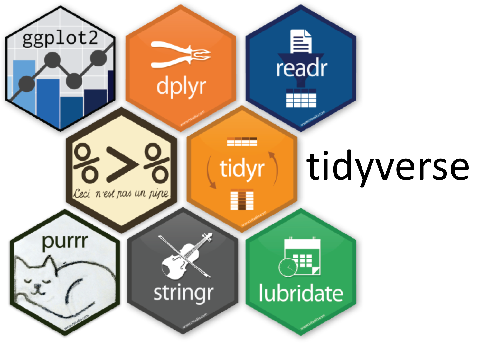
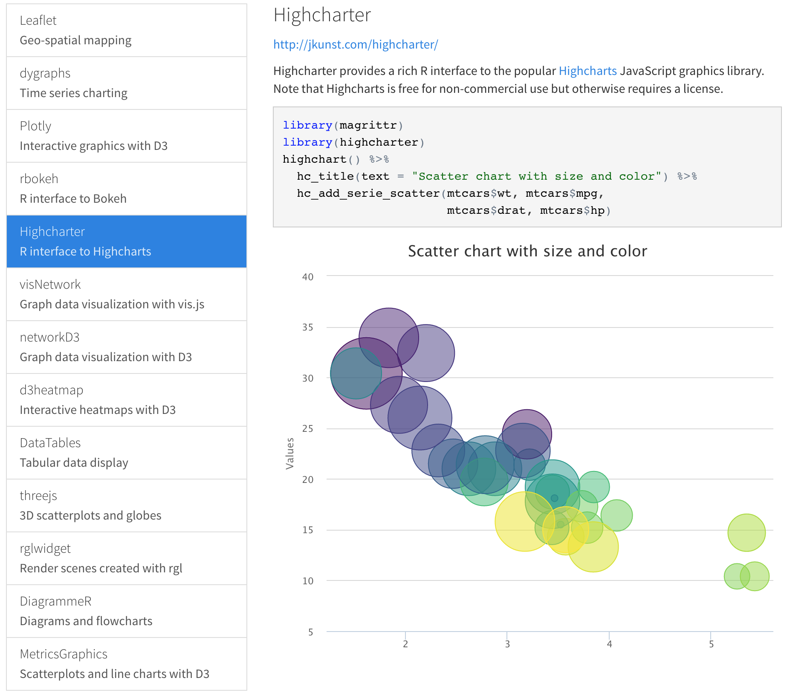
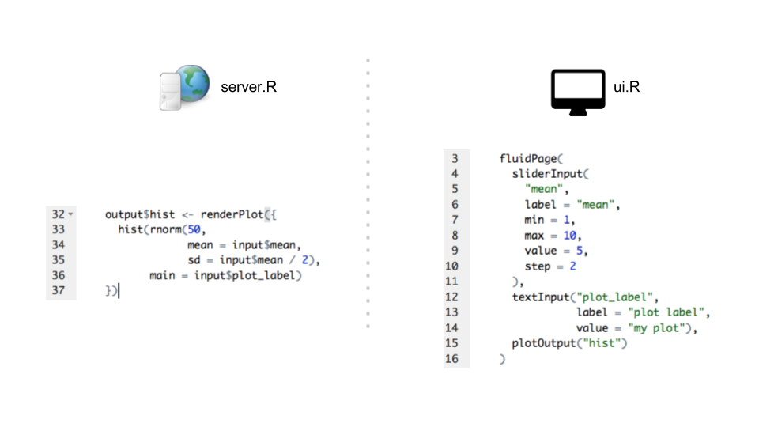
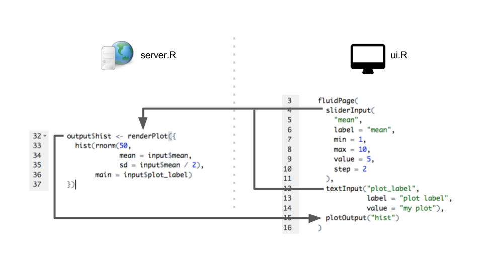
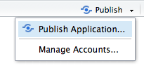
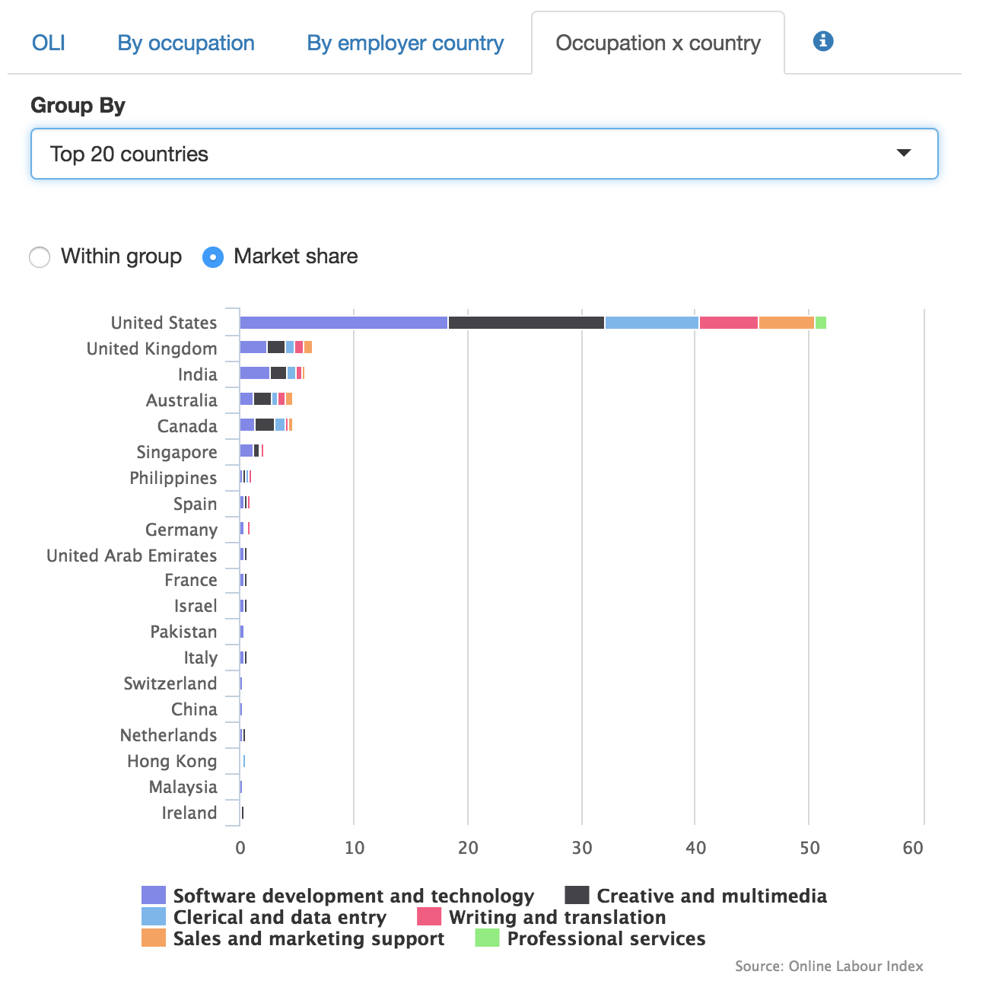
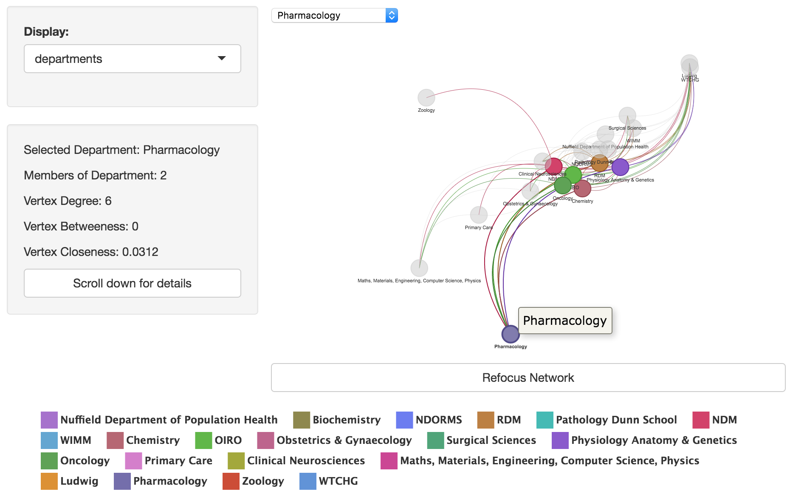

```{r, include=FALSE}
knitr::opts_chunk$set(fig.width=10, fig.height=6, fig.path='Figs/',
                      echo=FALSE, warning=FALSE, message=FALSE)
```

# What do you now about the R data visualisation stack?

<style type="text/css">
@import url("http://maxcdn.bootstrapcdn.com/bootstrap/3.3.6/css/bootstrap.min.css");
</style>

<style type="text/css">
@import url("https://raw.githubusercontent.com/ox-it/OxfordIDN_Talks/master/InteractiveViz-with_Shiny-and-others/www/teachingnotes.css");
</style>


>- Who has never used R before?

# R

R is a scripting language and a very powerful tool for data analysis and presentation, primarily due to the huge user base and their dedication to developing free and open source libraries/packages covering a vast range of different knowledge domains:

- Regression
- Machine Learning
- Image Analysis
- Network Analysis

R provides an excellent workflow for reproducible research; combining code with data, textual explanations and interactive data visualisations.

# Who's used RStudio?

<center></center>

# 

RStudio is a free, open-source IDE (integrated development environment) that provides an extremely powerful and friendly interface for developing with R.

RStudio is also the name of the developers of RStudio - they have developed an impressive stack of technologies for making R easier to use and more powerful for reproducible research and creating interactive data visualisatons.

Some of the technology they've built includes:

- RMarkdown
- htmlwidgets
- Shiny

# 

<div class="row">
  <div class="col-md-5" style="vertical-align:middle;">

  </div>
  <div class="col-md-7">
- The "tidyverse" is a collection of packages maintained by RStudio devs [particularly Hadley Wickham]
- tidyverse packages play extremely nicely together
- tidyverse packages are extremely useful for preparing data for interactive visualisations
- tidyverse packages are highly optimised, often specifically around nitpicky details of bse R (readr is a good example of this)
- tidyverse is the backbone of the recently published, free online book [R for Data Science](http://r4ds.had.co.nz)
  </div>
</div>

# Who's heard of RMarkdown?

<center></center>

# 

RMarkdown allows for code, text, images and interactive data visualisations to be combined together in the same document.

This presentation was built using RMarkdown and published to the free hosting platform RPubs.

<div class="incremental">
```{r, echo=TRUE, message=FALSE, warning=FALSE}
library(leaflet)
africa_data_points = data.frame(
  lat = rnorm(26, mean = 6.9, sd = 20),
  lng = rnorm(26, mean = 17.7, sd = 20),
  size = runif(26, 5, 10),
  label = letters
  )
leaflet(data = africa_data_points) %>%
  addTiles() %>%
  addCircleMarkers(popup = ~label, radius = ~size)
```
</div>

# Who's heard of htmlwidgets?

```{r, echo=FALSE}
library(visNetwork)
library(igraph)
library(dplyr)
library(readr)
## DOI: 10.4169/mathhorizons.23.4.18, nodes connected when within 15 words of one another
game_of_thrones <- read_csv("https://www.macalester.edu/~abeverid/data/stormofswords.csv")

game_of_thrones_igraph <- game_of_thrones %>%
  rename(from = Source, to = Target, width = Weight) %>%
  mutate(width = width / 5) %>%
  graph.data.frame(directed = FALSE)

V(game_of_thrones_igraph)$title <- V(game_of_thrones_igraph)$name
## Attribute due to https://github.com/datastorm-open/visNetwork/issues/74
V(game_of_thrones_igraph)$color <- rep("#1b9e77", vcount(game_of_thrones_igraph))

game_of_thrones_igraph %>%
  visIgraph(idToLabel = FALSE) %>%
  visOptions(highlightNearest = TRUE) %>%
  visEdges(color = list(color = "#d95f02"))
```

# htmlwidgets

htmlwidgets is a framework for binding R to a JavaScript library of choice, and to bundle this functionality into an easy to use library:

```{r, echo=TRUE, message=FALSE, warning=FALSE}
library(leaflet)
leaflet() %>%
  addTiles()
```

The [htmlwidgets.org](http://htmlwidgets.org) website provides an overview of some of the most popular htmlwidgets:

<center><a href="http://htmlwidgets.org"></a></center>

# Interactive tables:

<iframe src="https://livedataoxford.shinyapps.io/PhilippaMatthews_HEPITOPES/" width="100%" height="1000px"></iframe>

# Interactive ggplot2

If you use `ggplot2` and are not going *overboard* it's probably you can directly covert your charts into interactive charts using the `plotly` library:

# ggplot2: Interactive Points and Ribbons

```{r ggplot_data, echo=FALSE}
## verbatim from https://plot.ly/ggplot2/geom_ribbon/
set.seed(42)
x <- rep(0:100,10)
y <- 15 + 2*rnorm(1010,10,4)*x + rnorm(1010,20,100)
id<-rep(1:10,each=101)

dtfr <- data.frame(x=x ,y=y, id=id)

library(nlme)

model.mx <- lme(y~x,random=~1+x|id,data=dtfr)

#create data.frame with new values for predictors
#more than one predictor is possible
new.dat <- data.frame(x=0:100)
#predict response
new.dat$pred <- predict(model.mx, newdata=new.dat,level=0)

#create design matrix
Designmat <- model.matrix(eval(eval(model.mx$call$fixed)[-2]), new.dat[-ncol(new.dat)])

#compute standard error for predictions
predvar <- diag(Designmat %*% model.mx$varFix %*% t(Designmat))
new.dat$SE <- sqrt(predvar) 
new.dat$SE2 <- sqrt(predvar+model.mx$sigma^2)
```

```{r, echo=TRUE}
## verbatim from https://plot.ly/ggplot2/geom_ribbon/
library(ggplot2) 
p1 <- ggplot(new.dat,aes(x=x,y=pred)) + 
geom_line() +
geom_ribbon(aes(ymin=pred-2*SE2,ymax=pred+2*SE2),alpha=0.2,fill="red") +
geom_ribbon(aes(ymin=pred-2*SE,ymax=pred+2*SE),alpha=0.2,fill="blue") +
geom_point(data=dtfr,aes(x=x,y=y), size=1) +
scale_y_continuous("y")
p1
```

```{r, echo=TRUE}
library(plotly)
ggplotly(p1)
```

# ggplot2: Interactive Gantt Chart

<iframe src="https://livedataoxford.shinyapps.io/Mireia_Borrell/" width="100%" height="1000px"></iframe>

# Is that all you need?

If you're interested in building interactive maps, charts, networks with the ability for users to zoom/pan/filter* then these are the only tools you need:

- RStudio
- RMarkdown
- htmlwidgets

<div class="incremental">
Where can I learn more?!

Training here: 14th and 21st November 14:00-17:00

Lynda course: [Creating Interactive Presentations with Shiny and R](https://www.lynda.com/RStudio-tutorials/Creating-Interactive-Presentations-Shiny-R/452087-2.html)
</div>

# What if that's not all you need?

You might be exciting and want to have multiple [interdependent] charts, or for users of your visualisations to see additional information when they select data.

<iframe src="https://livedataoxford.shinyapps.io/Mireia_Borrell/" width="100%" height="1000px"></iframe>

# Shiny

Shiny is a web framework developed by RStudio that allows impressively interactive web applications to be created using R.

There's no need* to learn HTML or JavaScript to build these interactive apps.

# But these are complicated right?

<iframe src="https://livedataoxford.shinyapps.io/InteractiveViz-with_Shiny-with-others/" width="100%" height="1000px"></iframe>

# But these are complicated right?

<center></center>

# But these are complicated right?

<center></center>

# How about htmlwidgets and Shiny?

<iframe src="https://livedataoxford.shinyapps.io/OxRep_maps_shipwrecks/" width="100%" height="1000px"></iframe>

# Hosting these is complicated and expensive right?

Expense is related to complexity, so let's answer that first

# Shinyapps.io

shinyapps.io is a hosted solution for sharing Shiny apps on the web, run by RStudio.

There's a free tier of the service available that you can sign up for right now.

You can deploy 5 interactive applications for free, with a total of 25 interactive hours per month.

# Interactive Hours?

All accounts have a limited number of "active hours" - this is the time during which an app is running.

>- When a shiny app is first loaded a timer starts counting down the "active hours"
>- Multiple users can connect to the same "instance" of a shiny app and do not consume additional active hours.
>- Heavy loads will spawn new instances that will consume n * active hours

<div class="incremental">
When starting off with Shiny you're not going to hit 25 hours per month, experiment freely.

If you start hitting up against the 25 hours - the University is investing in a shinyapps.io subscription [and later a full service]
</div>

# Deploying these is complicated though?

Publishing your Shiny app to shinyapps.io is incredibly simple if you're using RStudio, simply click on the publish button.

<center></center>

# More examples of Shiny apps?

The Live Data project has been funded by IT Services to support researchers in creating interactive data visualisations, during this project we've learned how impressive [and easy to use] Shiny is for building visualisation case studies.

These are two of the visualisations we've built that I want to particularly highlight:

<a href="http://ilabour.oii.ox.ac.uk/online-labour-index/"></a>

<a href="https://livedataoxford.shinyapps.io/CRUK-Collaboration-Network/"></a>

# Things you might not believe are shiny apps

Built by [Dean Attali](daattali.com):

- [https://daattali.com/shiny/cfl/](https://daattali.com/shiny/cfl/)
- [https://daattali.com/shiny/timevis-demo/](https://daattali.com/shiny/timevis-demo/)

# Where can I learn more?

There is a step-by-step guide to learning Shiny produced by RStudio here: [http://shiny.rstudio.com/tutorial/](http://shiny.rstudio.com/tutorial/). This is how I originally learned Shiny in May 2015, it's a good course but may assume some knowledge you don't have.

But there are other online tutorials available, in fact Dean Attali has a great tutorial on [hosting your own Shiny server](http://deanattali.com/2015/05/09/setup-rstudio-shiny-server-digital-ocean/).

<div class="incremental">
Training here: 14th and 21st November 14:00-17:00

Lynda course: [Creating Interactive Presentations with Shiny and R](https://www.lynda.com/RStudio-tutorials/Creating-Interactive-Presentations-Shiny-R/452087-2.html)
</div>

